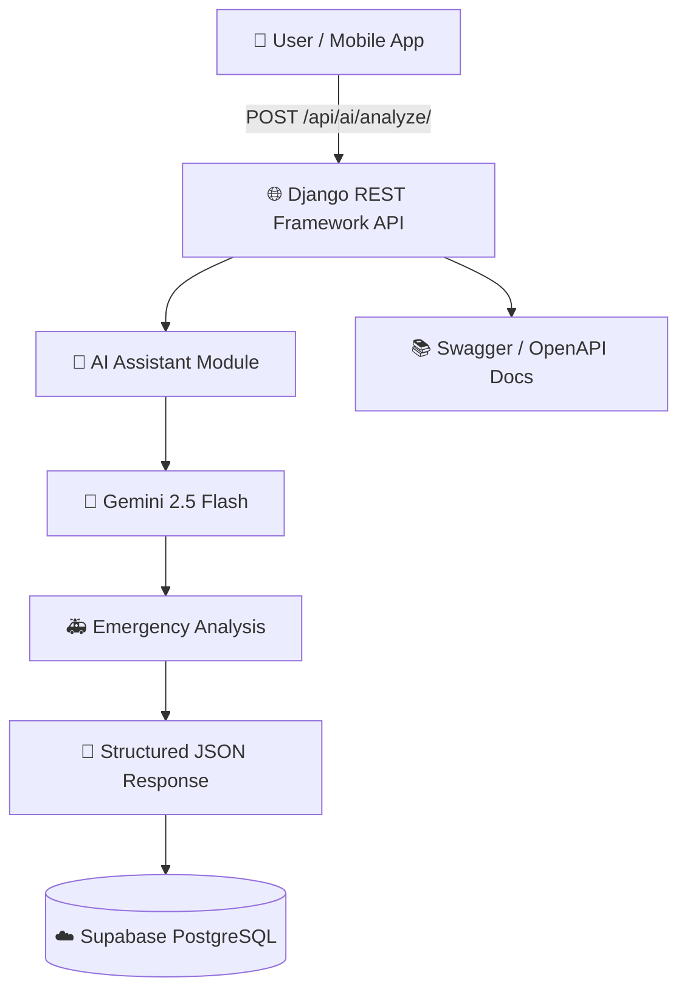

# 🏗️ EmergencyConnect-AI Architecture

```mermaid
flowchart TD

    A[👤 User / Mobile App]

    B[🌐 Django REST Framework API]

    C[🤖 AI Assistant Module]

    D[🧠 Gemini 2.5 Flash]

    E[🚑 Emergency Analysis]

    F[📄 Structured JSON Response]

    G[(☁️ Supabase PostgreSQL)]

    H[📚 Swagger / OpenAPI Docs]

    A -->|POST /api/ai/analyze/| B

    B --> C

    C --> D

    D --> E

    E --> F

    F --> G

    B --> H
```
